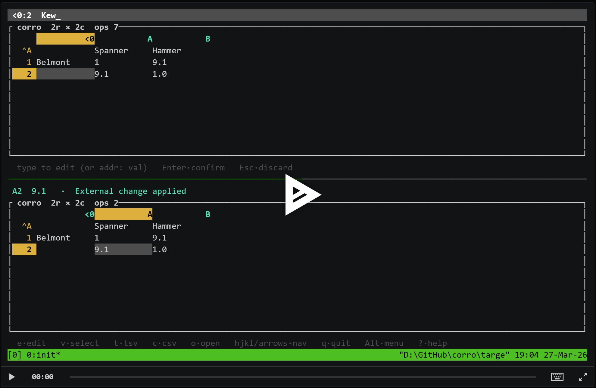

# corro (WIP)

`corro` is an early-stage Rust TUI spreadsheet experiment built around an **append-only JSONL operation log** and a small **sparse** sheet model.

There is now a working prototype release: [`0.0.1`](https://github.com/gmatht/corro/releases/tag/0.0.1).

## Prototype demo

`docs/corro.cast` is included in this repository as a quick terminal walkthrough.

Replay locally at 4x with `asciinema play -s 4 docs/corro.cast`.

## Current limitations

This is still a rough prototype and has important limitations:

- Creating a new file currently depends on shell workflows (for example `touch`) rather than an in-app flow.
- Instead of formulas, the current model uses special columns/rows, which are cleaner and harder to misuse.
- Formula support is still worth adding in the future for broader spreadsheet compatibility and expressiveness.

See `DESIGN.md` for the current architecture and decisions.

