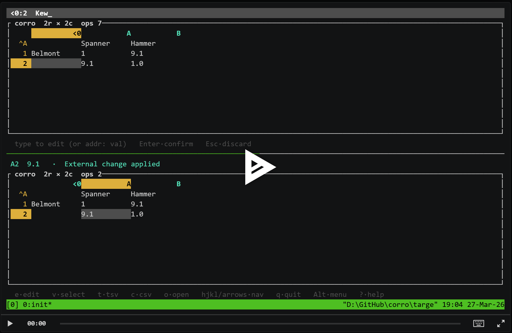

# corro (WIP)

`corro` is an early-stage Rust TUI spreadsheet experiment built around an **append-only text operation log** and a small **sparse** workbook model.

There is now a working prototype release: [`0.0.1`](https://github.com/gmatht/corro/releases/tag/0.0.1).

## Prototype demo

`docs/corro.cast` is included in this repository as a quick terminal walkthrough.

Replay locally at 4x with `asciinema play -s 4 docs/corro.cast`.

## Current limitations

This is still a rough prototype and has important limitations:

- Creating a new file currently depends on shell workflows (for example `touch`) rather than an in-app flow.
- Instead of formulas, the current model uses special columns/rows, which are cleaner and harder to misuse.
- Workbook tabs are supported with stable numeric sheet IDs and a bottom tab bar when more than one sheet exists.

See `DESIGN.md` for the current architecture and decisions.

## Unsaved Files & Testing

corro can auto-create a per-user untitled `.corro` file on first edit so the existing on-disk commit/watch flows (and the LogWatcher) work unchanged. A few environment variables and test helpers control this behavior:

- CORRO_AUTO_UNSAVED: runtime toggle. If set to `0` the app will not auto-create an unsaved file on first edit. By default auto-create is enabled for normal runs.
- CORRO_UNSAVED_TEST_DIR: test-only override. When set, the process will use this directory as the default unsaved directory. Unit tests use this to isolate created files in temporary locations instead of mutating XDG_STATE_HOME or HOME.
- CORRO_AUTO_UNSAVED_TEST: some unit tests set this variable during their run; tests commonly also enable auto-create on the App instance (tests set `app.unsaved_auto_create = true`) to exercise the unsaved-file creation and commit flows.

Unsaved files are created under the platform-appropriate per-user state directory (examples):

- Linux: `$XDG_STATE_HOME/corro/unsaved` or fallback `~/.corro/unsaved`
- macOS: `~/Library/Application Support/corro/unsaved`
- Windows: `%LOCALAPPDATA%\corro\unsaved` (with fallbacks)

Files are named like `unsaved-<pid>-<nanos>.corro`. The app intentionally does not perform automatic cleanup of these files so their lifetime is tied to user expectations and external workflows.
