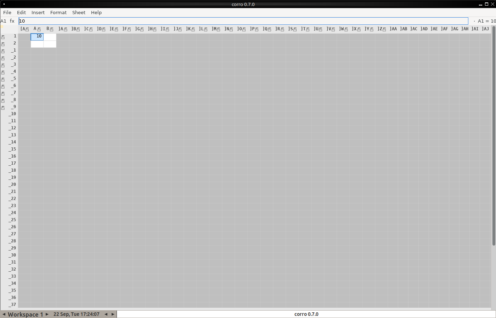

# corro screenshots



Captured headlessly from the GTK build by `scripts/screenshot.sh` - no
display, no window manager session, and no synthetic keystrokes: each image
is a fresh process whose workbook is built by scripted edits
(`CORRO_EDIT_SCRIPT`), applied through the ordinary commit path.

Regenerate with:

```bash
cargo build --features gui        # `gui` is not a default feature
scripts/screenshot.sh             # writes dist/screenshots/
```

The images are checked in (`.gitignore` allows `dist/screenshots/`) so they
can be linked from documentation; re-run the script after a UI change.

## The shots

| Image | Shows |
|---|---|
| [`shot-01-blank.png`](shot-01-blank.png) | A freshly opened workbook: the six-menu bar, the formula bar (fx plus the address and value boxes), the row/column headers with their margin columns and the seeded TOTAL aggregates, and the status line. |
| [`shot-02-populated.png`](shot-02-populated.png) | Literal columns (A) beside formula columns (B), both computed by the shared engine: `=A1*2` in each B cell and a `=SUM(B1:B3)` total. Header labels, per-cell values and the formula bar all come from the same render path the desktop GTK build uses. |
| [`shot-03-formula.png`](shot-03-formula.png) | Formula entry: a nested `=IF(...)` in the input line, with the computed results (956.7, and the branch the condition selected) in the grid. Shows the formula bar rendering text wider than the cell that holds it. |

## What each one is for

They are chosen to cover the parts of the UI a change is most likely to
break, and that a text diff cannot show:

* **Chrome geometry.** The formula bar, headers and status line are drawn by
  the shared renderer, so a metrics change (a scale factor, a font advance)
  shows up here before it shows up as a mis-click somewhere else.
* **The engine's output, rendered.** The `populated` and `formula` shots
  put literal cells next to computed ones, so a formula regression is
  visible as a wrong number rather than only as a failing unit test.
* **Canvas replay.** Every pixel inside the grid comes from Rust's
  `DrawContext` closure replayed by the backend, not from native widgets.
  These images are therefore the end-to-end check of that path - the same
  closure the ratatui, GTK, Windows and Android builds replay.

## Other backends

The script captures the GTK build because it is the one that runs on this
host. The widget tree it renders is the shared one: the same
`corro::gui::gui_backend::run_gui` drives every GUI backend, and macOS
(AppKit), iOS (UIKit) and Android differ only in the adapter underneath.
See `rustxWidgets/docs/MACOS_GUIDELINES.md` and `IOS_GUIDELINES.md`.

The terminal build has its own captures: `scripts/demo_movie.py` and
`dist/corro-gui-movie.mp4` (see the README, "Recording a video").
