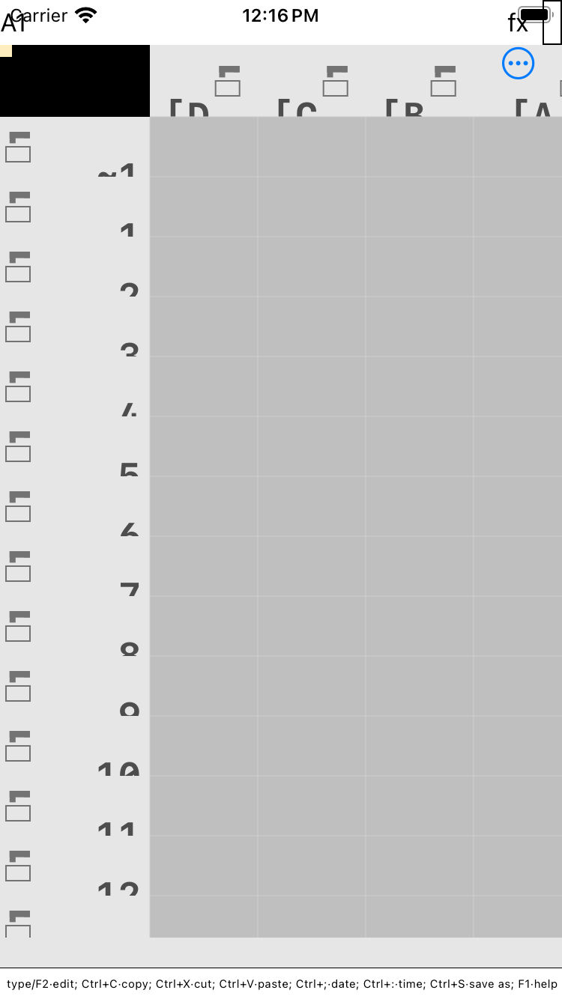

# iOS screenshots

**`ios-first-frame.png` is the real thing**: corro's iOS app, built and run on an
iPhone SE simulator by `.github/workflows/ios.yml`.



750x1334 (375x667 points at 2x), captured by `xcrun simctl io … screenshot` on
the run that first passed every step — the screenshot, the health check, and an
image check that verifies the frame is corro's chrome and not the simulator's
home screen.

This file previously opened by saying no such image could exist. It could, and
it does; the sections below record why it took a while and what is still
missing.

## What the image shows

The full widget tree, rendered by the UIKit backend:

* the **navigation bar** with the host's menu item (the "≡" on the left, which
  the host builds from the model `corro::gui::ios_backend::menu_model`
  publishes — a phone has no room for six text menus);
* the **formula bar**: the address box, the `fx` label, and the entry;
* the **sheet canvas**, with the column header strip, the row-label gutter with
  its margin columns, and the grid itself;
* the **status line** at the bottom.

Every pixel inside the grid comes from Rust's `DrawContext` closure replayed
into a live `CGContext` — the same closure the ratatui, GTK, Windows and Android
builds replay. So this one frame exercises the whole port end to end: the ObjC
compiles, the shims resolve, `init_with_root` wires the view controller's view,
the tree builds, and Core Graphics draws it at the right size.

## What it does NOT show

* **Interaction.** It is one frame. Touch → canvas click, and soft-keyboard
  typing → `corro_ios_entry_changed` → commit, are the paths still unverified;
  `docs/ios/README.md` has the `simctl` recipe for those.
* **The iPhone metrics at their best.** This is a 375x667 device; the retina
  scaling (`UIScreen.scale`) is exercised, the Plus/X-era 3x path is not.
* **iOS 7.1.2.** No hosted runner has the archived SDK (§0 of the guidelines).

`desktop-render-for-comparison.png` beside it is the same widget tree drawn by
the desktop GTK backend. The two are worth comparing: the structure is
identical, which is the point of the shared `gui_backend` pipeline, while the
chrome sizes differ because the iOS backend scales its metrics by
`UIScreen.scale`.

## How it was obtained, and why that took 100 runs

The app could not be built on the machine the port was written on (no Xcode, no
Apple SDK), so a hosted `macos-14` runner does it: build the staticlib, xcodebuild
the app, boot a simulator, install, launch, screenshot, and check the app drew.

Getting to a *meaningful* green took ~100 runs, and the failures were worth
recording because most were not the app's:

1. **The workflow's own probes.** Three liveness checks were each wrong: `launchctl
   list` reads the simulator's own daemons, `pgrep` does not exist inside the
   simulator, and `ps` does not either — so it printed nothing and reported a
   healthy app as dead on every run.

2. **A green run whose artifact was the home screen.** Run #97 passed every
   step, and `ios-first-frame.png` was the springboard: the app needs ~90 s to
   reach its first frame cold, and the screenshot ran 22 s *before* the app
   started. The health check missed it because it grepped a *second* launch for
   readiness, proving "corro can run" rather than "the process that was
   screenshotted ran".

3. **The bug underneath all of it.** Once the draw callback was made to report
   its own panics, the log finally said:

   ```
   DRAW_CALLBACK called: w=375 h=616
   fatal runtime error: Rust cannot catch foreign exceptions, aborting
   SIGABRT
   ```

   An Objective-C exception crossing into Rust: `CorroIosText`'s `measure:` and
   `drawText:…` selectors are sent to the **class** (the shim is stateless and
   never instantiated), but `drawText:` was implemented as an **instance**
   method, so `[CorroIosText drawText:…]` raised "unrecognized selector sent to
   instance" on the first real frame. Fixed in the generator's signature table
   (so the header and the host agree by construction) and in the host's `.m`;
   `ios/corro/scripts/check_selectors.sh` now fails on an instance-method
   definition of a class-sent selector, and that check was tested by reverting
   the sign.

The workflow now also refuses to publish a home-screen screenshot: an image
check measures the achromatic fraction of the lower two thirds and requires
>50% (corro's chrome is neutral grey throughout — measured 100% for this frame,
98.7% for a real desktop render, 2.2% for the home screen that shipped once).

## Running corro's GUI here (verified)

`xwininfo -root -tree` on `:99` shows a real toplevel:

```
0x400003 "corro 0.7.0": ("corro" "Corro")  1200x800+0+0
```

Two requirements, both learned by watching it fail:

* **Use a LIVE display.** X sockets exist for `:0`, `:66` and `:78` in this
  container, but only `:99` answers `xdpyinfo`. Launching on a dead one produces
  NO error: the process sits in state `S` indefinitely while GTK waits, and
  stderr has been redirected to `~/.corro/debug.log` (`src/main.rs` does that),
  so the log stays empty too.
* **Detach with `setsid`.** A plain background job ends up in state `T`
  (stopped), because job control stops it as the parent command exits.

```sh
setsid env DISPLAY=:99 ./target/debug/corro --gui subtotal.corro \
  > /tmp/gui.log 2>&1 < /dev/null &
sleep 45
DISPLAY=:99 xwininfo -root -tree | grep corro        # the toplevel
DISPLAY=:99 import -window 0x400003 shot.png         # capture it
```

A good capture is recognisable numerically: ~500 distinct colours, grid grey
`#BFBFBF` dominant, and most rows being grid lines. A blank window shows one or
two colours instead - which is how the earlier blank canvases were caught.

## Reproducing it

```
gh workflow run ios.yml --repo gmatht/corro        # or push a change under ios/
gh run download --repo gmatht/corro --name ios-simulator-screenshots
```

No secrets are needed: simulator builds are unsigned. On a Mac of your own,
`ios/corro/build_ios.sh sim --run` builds and launches it directly.
